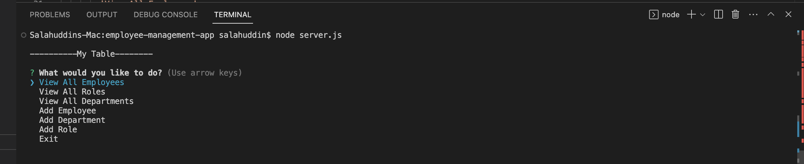
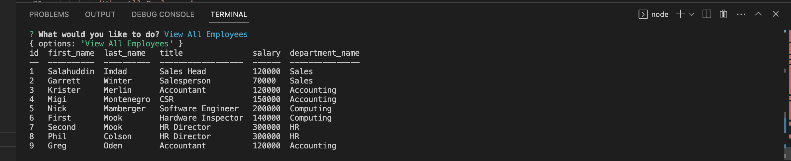

# employee-management-app
## Description

Employee-management-app is an app that creates command line prompts that allow the User to manage their organization structiures. It allows them to create, update and delete data related to specific employees, roles and departments.

  ## Table of Contents
  - [Usage](#Usage)
  - [Credits](#Credits)
  - [License](#License)
  - [Features](#Features)
  - [Contribution](#Contribution)
  - [Questions](#Questions)

## Usage
  * Run 'npm i' in your terminal to install relavent packages.
  * Run 'node server.js' to connect to server.

  - Here is a screenshot of the of the main menu in the command line:

  

   - Here is a screenshot of choosing one of the options:

  

  Here is a link to a demo: - https://github.com/Sal8298/employee-management-app/blob/main/public/images/Demo.webm

  ## Credits
    * https://github.com/Sal8298
    * https://github.com/aliciagorton/12-MySQL-Homework-Employee-Tracker

  ## License
  * MIT

  ## Features
  * Store data about employeees, roles and departments.
  * Create, Update and Delete this data.

  ## Contribution
  * To contribute you may reach me via email at sal@email.com.

  ## Questions
  [Link to my Github profile](https://github.com/Sal8298)
  Any Questions? If so, you can reach out to me at sal@email.com.